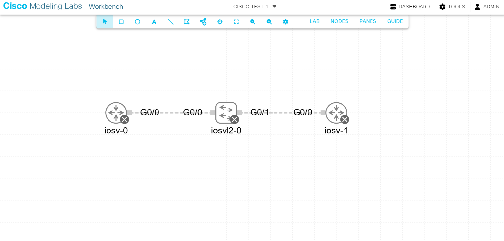

## IP Addressing Table

| Device | Hostname | Interface | IP Address | Subnet Mask | Description |
|:---|:---|:---|:---|:---|:---|
| iosv-0 | **R1** | GigabitEthernet0/0 | `10.1.1.254` | `255.255.255.0` | Connection to Switch |
| iosvl2-0 | **S1** | Vlan1 (SVI) | `10.1.1.252` | `255.255.255.0` | Switch Management IP |
| iosv-1 | **R2** | GigabitEthernet0/0 | `10.1.1.253` | `255.255.255.0` | Connection to Switch |

---

## Configurations

All configuration scripts are located in the `configs/` directory.

* [R1 Configuration Script](configs/R1.cfg)
* [S1 Configuration Script](configs/S1.cfg)
* [R2 Configuration Script](configs/R2.cfg)

---

## Deployment & Verification

### 1. Applying Configurations
To configure each device, access the console in CML, enter privileged EXEC mode, enter global configuration mode, and paste the respective configuration scripts:

```syslog
Router> enable
Router# configure terminal
Enter configuration commands, one per line. End with CNTL/Z.
Router(config)# <Paste the configuration commands here>
```

### 2. Verifying IP Settings
Run the following command on any device to verify that the interfaces are configured with the correct IP addresses and are in an "up/up" status:

```syslog
show ip interface brief
```

*Example Output (R1):*
```syslog
Interface                  IP-Address      OK? Method Status                Protocol
GigabitEthernet0/0         10.1.1.254      YES manual up                    up      
```

### 3. Testing Connectivity
Perform a ping test from each device to verify end-to-end connectivity across the network segment.

*From **R1** to **R2**:*
```syslog
R1# ping 10.1.1.253
Type escape sequence to abort.
Sending 5, 100-byte ICMP Echos to 10.1.1.253, timeout is 2 seconds:
!!!!!
Success rate is 100 percent (5/5), round-trip min/avg/max = 1/1/1 ms
```